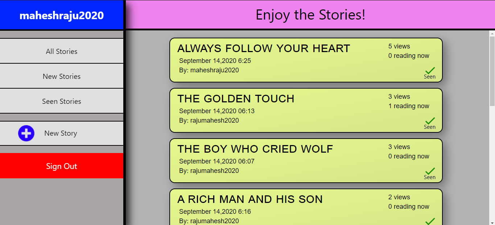

# Read Count System

This is a simple webapp, which can display stories, and will also keep track the number of total views and number of people currently reading the story.

This webapp is made using React Js, HTML/CSS, javaScript and firebase.

## How the View-Count Works

The offline one is quite simple, an array is maintained for each story, and when a user views the story, (i.e clicks on the story card), his unique email-id is added in that array, in this way we maintain the total views of the story. This also ensures that for each email-id, view is counted only once.

The Live Watch Counting, is also done implementing arrays, when a user clicks on the card of a story, his username is added to the live_watching array of that particular story, and when the user clicks the back button, we detect the un-mount of the react component and remove the current-user's mail-id from the live_watching array, thus maintaining the live-watch counter.

In live watch counter, a situation arises, where the user might close the current tab of the browser, or close the whole browser, and this might lead to problems as we cant detect component un-mount here, and the user's contribution will be continued in the live watch counter. So, in order to handle this, I used <b> beforeunload </b> function to detect such conditions and update the database.

## Some Screenshots

You can view this webapp here,
https://read-count-sys.herokuapp.com/

Also, the couple of stories used in this webapp, is randomly picked through google search.
